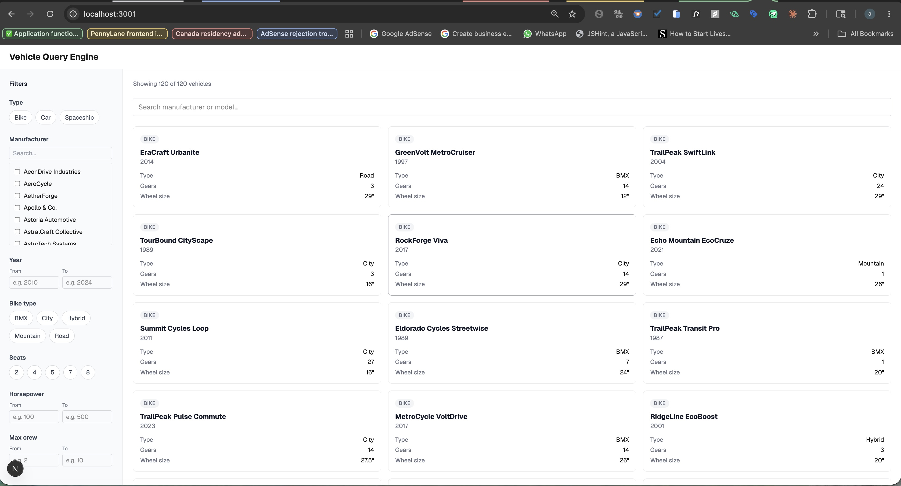
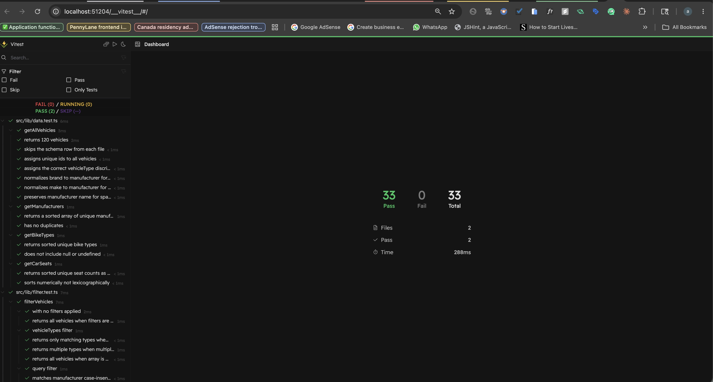

# Vehicle Query Engine

This is my take-home assignment for Xanadu. The app lets users browse and filter vehicles across three categories: bikes, cars, and spaceships.

---

## Running the project

```bash
npm install
npm run dev
```

Open `http://localhost:3001`

**Live:** https://vehicle-query-engine.vercel.app

---

## Screenshots



---

## How it works

Open the app and you see all 120 vehicles in a grid. Cards show the basics (manufacturer, model, year, type) plus type-specific fields — gears and wheel size for bikes, horsepower and seats for cars, max crew for spaceships.

The sidebar holds the filters:
- **Type** — pick one or more (bike, car, spaceship)
- **Manufacturer** — checkbox list with a search-within-filter input
- **Year** — min/max range
- **Type-specific filters** — bike type, seats, horsepower, max crew  these appear only when their relevant type is selected (or when you're browsing all types)

The search box above the grid does substring matching on manufacturer and model. All filters compose combine type + manufacturer + year to drill down.

---

## Tech Stack

Next.js 16.2.6 (App Router), TypeScript, Tailwind CSS. Node v20.10.0.

The app is fully client-side. All data is stored in local JSON files and filtering happens in the browser.

---

## Implementation Notes

### Unified vehicle model

The JSON files for bikes, cars, and spaceships are similar but not consistent. Some use `brand`, others use `make` or `manufacturer`.

To keep the system consistent, I normalized everything into a single discriminated union:

```
Vehicle = Bike | Car | Spaceship
```

using `vehicleType` as the discriminator. This allows TypeScript to correctly narrow types and keeps vehicle-specific fields (like `gears`, `horsepower`, `maxCrew`) safe to access only in the correct context.

The first entry in each JSON file is schema metadata, not a real record, so it is skipped during parsing.

### Filtering logic

All filtering logic is isolated in `lib/filter.ts` as a pure function:

```
filterVehicles(vehicles, filters)
```

It has no React dependency, which keeps it easy to test and portable if it ever needs to move to a backend or a worker.

### Dynamic filters by vehicle type

Filters change based on the selected vehicle type:

- Bike filters are hidden when viewing cars or spaceships
- Seat filters apply only to cars
- Crew filters apply only to spaceships

When no type is selected, all filters remain visible. This keeps the UI aligned with what the user is actually browsing.

### Filter set

The filter set itself was a design decision. I looked at the data and picked filters where the values are bounded enough to be useful in a UI. Vehicle type, manufacturer, year range, and the type-specific ones (bike type, seats, horsepower range, max crew range) cover most ways a user would narrow the list. I skipped a few possible filters  colour for cars, wheel size for bikes, top speed because they would add noise without much value at this scale. They could be added later without changing the filter logic, just new entries in the `Filters` type and a new component each.

### Filter design

Each filter has a single responsibility. For example, the seats filter only filters cars by seat count  it does not exclude other vehicle types implicitly.

So filtering is always explicit: select Car, then apply Seats = 5. This avoids hidden logic and keeps behavior predictable.

### Search behavior

Search input updates immediately, but filtering is debounced by 300ms. Only text search is debounced. Dropdowns and checkboxes are applied instantly since they are discrete actions.

### State management

Filter state lives in the page component. Each filter component receives its current value as props and sends updates upward via callbacks. The sidebar composes these updates into a single filter object. This keeps state flow simple and avoids global state.

---

## Performance

With ~120 records, filtering and rendering are already fast. For that reason, I did not add virtualization or pagination  they would add unnecessary complexity without measurable benefit at this scale.

Instead, I focused on lightweight optimizations:

- `useMemo` for filtered results
- Debounced search input
- Precomputed static filter lists (manufacturers, bike types, etc.)

---

## Tests

```bash
npm test
```

Tests cover the two layers that have real logic in them: the pure filter function and the data normalization layer. Nothing else has logic worth unit testing the components are controlled and stateless, so they're covered by using the app.

The filter suite verifies every filter dimension type, manufacturer, year range, bike type, seats, horsepower, max crew plus composition (AND semantics across multiple active filters), type-specific passthrough behavior (e.g. the seats filter doesn't knock out bikes), and edge cases like whitespace-only queries.

The data suite verifies that schema rows are skipped, all 120 records load, IDs are unique across files, field renames are correct (`brand` → `manufacturer` for bikes, `make` → `manufacturer` for cars), and the `vehicleType` discriminator is set correctly on every record.

33 tests, sub-second execution. Runner is Vitest — it has a built-in UI (`npx vitest --ui`) for browsing results by file and describe block.



---

## Future improvements

- Sync filters to URL using `useSearchParams` for shareable states and refresh persistence
- Add vehicle detail page (`/vehicles/[id]`)
- Add sorting by year, manufacturer, or horsepower
- Improve mobile UX with a filter drawer or bottom sheet
- Show schema descriptions as tooltips on filter labels (already available in the JSON metadata)

---

## Scaling considerations

If the dataset grows:

- **~10K records:** add virtualization and possibly a web worker for filtering
- **~100K+ records:** move filtering and pagination to a backend API

The architecture keeps filtering logic decoupled, so scaling does not require rewriting core logic.

---

## Folder structure

```
src/
  app/
    layout.tsx
    page.tsx

  components/
    AppShell.tsx
    Navbar.tsx
    Sidebar.tsx
    VehicleCard.tsx
    filters/
      TypeFilter.tsx
      ManufacturerFilter.tsx
      YearRangeFilter.tsx
      BikeTypeFilter.tsx
      SeatsFilter.tsx
      HorsepowerFilter.tsx
      MaxCrewFilter.tsx

  data/
    bikes.json
    cars.json
    spaceships.json

  lib/
    types.ts
    data.ts
    data.test.ts
    filter.ts
    filter.test.ts
    useDebounce.ts
```
